<h1 align="center">⚖️ Nyaya-Sutra: Nyaya-Sahayak Lakehouse</h1>

<p align="center">
  A Databricks-native, agentic legal and welfare assistant for India.
  Powered by quantized local LLMs, RAG over new Indian law statutes (BNS, BNSS, BSA), and government schemes.
</p>

<p align="center">
  
  
  
  
  
</p>

---

## ✨ Features

- **Agentic Orchestration:** Intelligent routing between Specialized Agents (Legal, Welfare, Drafting, Guardrail, Translation) using an Orchestrator Agent.
- **Legal RAG Pipeline:** Context-aware retrieval over the Bharatiya Nyaya Sanhita (BNS), Bharatiya Nagarik Suraksha Sanhita (BNSS), Bharatiya Sakshya Adhiniyam (BSA), and the Constitution.
- **Multilingual Support:** Bidirectional Indic translation via IndicTrans2 (local CPU) and Google Gemini (for Document Drafting API). Supports 10+ Indian languages including Hindi, Marathi, Tamil, Bengali, Kannada, Telugu, Gujarati, Malayalam, and Punjabi.
- **AI Document Drafter:** Generates formatted formal legal documents (FIRs, Notices, Agreements). Translates them on the fly and exports them directly natively to PDF.
- **Welfare Scheme Wizard:** Interactive demographic form that matches citizens with applicable government schemes and legal aid utilizing PySpark SQL and FAISS.
- **Databricks Native:** Runs completely within Databricks Free Edition constraints via a Medallion Lakehouse architecture (Bronze, Silver, Gold).
- **Comprehensive Evaluation:** Built-in MLflow benchmarking suite integrating RAGAS metrics and BhashaBench-Legal MCQ.

---

## 🏗️ Architecture Overview



The system utilizes a **Medallion Lakehouse Architecture** integrated with a multi-agent orchestration pipeline designed for CPU-bound environments.

**Lakehouse Data Flow:**
- 🥉 **Bronze:** Raw PDFs, JSONs, and CSVs ingested directly into Delta tables.
- 🥈 **Silver:** Cleaned and structured tables (`law_sections`, `schemes_curated`, `ipc_bns_map`).
- 🥇 **Gold:** Chunked embeddings and serialized FAISS indexes optimized for extremely fast semantic retrieval.

**Agentic Pipeline:**
```text
User Query → Streamlit UI → Orchestrator Agent
                              ├─ Translation Agent (IndicTrans2 / Gemini)
                              ├─ Intent Classifier
                              ├─ Legal Agent → FAISS RAG → Param-1 LLM
                              ├─ Welfare Agent → Scheme SQL + FAISS → Param-1 LLM
                              ├─ Drafting Agent → Synthesizes Legal Docs → PDF Export
                              ├─ Guardrail Agent → Safety & Disclaimers
                              └─ (Optional) Multi-LLM Comparator
```

---

## 📂 Project Structure

```text
nyaya-sahayak/
├── app.yaml                    # Databricks App deployment config
├── requirements.txt            # Python dependencies
├── .env.example                # Environment variable template
├── README.md                   # Documentation
│
├── core/                       # Shared config & data models
│   ├── config.py               # Central configuration (env vars, paths, table names)
│   └── data_models.py          # Pydantic models (UserQuery, LegalAnswer, etc.)
│
├── models/
│   ├── llm/
│   │   ├── param1_runner.py    # CPU inference via llama-cpp-python (GGUF Q8_0)
│   │   ├── model_loader.py     # Loads quantized GGUF into RAM
│   │   ├── router.py           # Selects model based on language/persona
│   │   └── comparator.py       # Multi-LLM comparison with referee
│   ├── translation/
│   │   └── indictrans2_runner.py  # IndicTrans2 via CTranslate2 (CPU)
│   ├── embeddings/
│   │   └── embedder.py         # sentence-transformers for FAISS indexing
│   └── nlp_classifier/
│       └── intent_classifier.py   # Keyword + heuristic intent classification
│
├── rag/                        # Retrieval-Augmented Generation
│   ├── retriever.py            # FAISS search with act-specific filtering
│   ├── pipeline.py             # End-to-end: retrieve → prompt → generate
│   └── prompts.py              # Persona-aware prompt templates
│
├── agents/                     # Agentic pipeline
│   ├── orchestrator.py         # Core routing: classify → delegate → assemble
│   ├── legal_agent.py          # RAG for BNS/BNSS/BSA + IPC→BNS mapping
│   ├── welfare_agent.py        # Scheme recommendations + legal aid eligibility
│   ├── translation_agent.py    # Bidirectional IndicTrans2 wrapper
│   ├── guardrail_agent.py      # Safety checks + disclaimers
│   └── tools/
│       ├── sql_welfare_tool.py # PySpark SQL for scheme filtering
│       └── faiss_legal_tool.py # FAISS similarity search interface
│
├── evaluation/                 # MLflow benchmarking suite
│   ├── ragas_metrics.py        # Faithfulness, AnswerAccuracy, ContextPrecision
│   ├── bhashabench_eval.py     # BhashaBench-Legal MCQ evaluation
│   ├── trajectory_eval.py      # Orchestrator routing accuracy
│   └── latency_tracker.py      # TTFT, TPOT, pipeline latency
│
├── notebooks/                  # Databricks-compatible scripts
│   ├── 01_data_ingestion.py    # Bronze: raw data → Delta tables
│   ├── 02_delta_faiss_prep.py  # Silver + Gold: clean, chunk, embed, index
│   ├── 03_model_download.py    # Fetch GGUF + IndicTrans2 weights
│   └── 04_mlflow_evaluation.py # Run full evaluation suite
│
├── app/                        # Streamlit frontend
│   ├── main.py                 # Entry point (referenced by app.yaml)
│   ├── state_manager.py        # Session state & chat history
│   └── components/
│       ├── chat_view.py        # Conversational UI (citizen/lawyer)
│       ├── scheme_wizard.py    # Demographic form → scheme matching
│       └── performance_dashboard.py  # MLflow metrics display
│
└── data/                       # Data directory (gitignored, use DBFS/Volumes)
    ├── bronze/                 # Raw data files (Laws, mapping, schemes)
    ├── silver/                 # Intermediate cleaned data
    └── gold/                   # FAISS indexes
```

---

## ⚙️ Prerequisites

- **Python 3.10+**
- Minimum **16 GB RAM** (required to load the quantized LLM, FAISS indices, and embeddings locally).
- **Databricks Account**: Free Edition is sufficient for full deployment.
- **Git** version control.

---

## 🚀 Setup Instructions

### 1. Clone & Virtual Environment

```bash
git clone <your-repo-url> nyaya-sahayak
cd nyaya-sahayak

# Create & activate a virtual environment
python -m venv .venv
source .venv/bin/activate       # Linux/Mac
# .venv\Scripts\activate        # Windows

# Install dependencies
pip install -r requirements.txt
```

### 2. Environment Configuration

Copy the example environment file and format your `.env`:
```bash
cp .env.example .env
```

**Key `.env` Variables:**
| Variable | Description | Example |
|----------|-------------|---------|
| `DATABRICKS_HOST` | Your Databricks workspace URL | `https://dbc-xxxxx.cloud.databricks.com` |
| `DATABRICKS_TOKEN` | Personal access token | `dapi_xxxxxxxxxx` |


### 3. Model Downloads

We run **Param-1 2.9B** using a GGUF Quantized model (8-bit) via `llama.cpp` for CPU-bound inference, and **IndicTrans2** via `CTranslate2` for efficient CPU translation. 

To auto-download models and weights, run the provided notebook script:
```bash
python notebooks/03_model_download.py
```

### 4. Data Preparation

Set up the required data folders architecture:
```bash
mkdir -p data/bronze/{laws,ipc_bns_mapping,schemes,legal_aid,eval}
mkdir -p data/gold/faiss
```
Ensure you have dumped your JSON files inside the respective `data/bronze/` folders.

Process the Lakehouse Medallion pipeline to clean and index (Bronze → Silver → Gold):
```bash
python notebooks/01_data_ingestion.py
python notebooks/02_delta_faiss_prep.py
```

---

## 🛠️ Running the Application

To launch the multi-tab Streamlit frontend wrapper locally:

```bash
streamlit run app/main.py --server.port 8501
```
Navigate to `http://localhost:8501` to access:
1. **💬 Chat (Citizen/Lawyer):** Conversational AI for simple legal queries.
2. **🏛️ Scheme Wizard:** Survey form to retrieve matching government schemes.
3. **Document Drafter:** Get an FIR/GR document sample based on your intents
---

## ☁️ Databricks Deployment

1. Commit and push your codebase to a Git repository.
2. Inside your Databricks workspace, navigate to **Apps → Create App**.
3. Point to your repository and assign `app.yaml` as the deployment configuration.
4. Run app as: `databricks apps deploy <my-app-name> --source-code-path /Workspace/Users/<email>/my-app-folder`
---

## ⚠️ Databricks Free Edition Constraints

| Resource | Limit | Our Optimization Strategy |
|----------|-------|---------------------------|
| **RAM** | ~15 GB | Runs LLMs + Databricks Vector Search + IndicTrans2 (~2 GB) transaltion perfectly within limits |
| **GPU** | None | We do RAG on CPU using LLMs |

---

<p align="center">
  <b>Built for the Databricks Hackathon.</b> <br>
  <i>⚠️ Educational and demonstration purposes only. This AI system does not constitute professional legal advice. Consult a qualified advocate before undertaking any legal action.</i>
</p>
